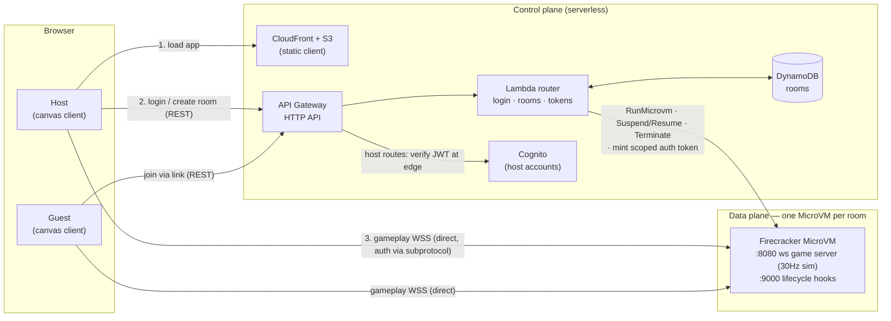

# MicroVM Asteroids

Multiplayer [Asteroids](https://en.wikipedia.org/wiki/Asteroids_(video_game)) on
**AWS Lambda MicroVMs**. One host logs in, creates a room (picking a game mode),
and shares a link; others join with no login. **Each room is a dedicated
Firecracker MicroVM** running an authoritative game server.

This is a reference sample showing how to use Lambda MicroVMs for sessionful,
real-time, WebSocket workloads — with a serverless control plane in front.

## Architecture



Two planes that never mix:

- **Control plane** (`packages/control-plane`, `packages/infra`) — Lambda + API
  Gateway (HTTP API) + DynamoDB + Cognito, deployed with AWS CDK. Handles host
  login (Cognito), room lifecycle (`RunMicrovm` / `Suspend` / `Resume` /
  `TerminateMicrovm`), and minting short-lived MicroVM auth tokens. Also hosts
  the static web client on S3 + CloudFront.
- **Data plane** (`packages/game-server`) — runs *inside* each MicroVM. The
  browser connects a WebSocket **directly** to the room's MicroVM endpoint. Auth
  and target port travel as `lambda-microvms.*` WebSocket subprotocols (browsers
  can't set WS headers); the proxy strips them before they reach the server.

```
packages/
  shared/         wire protocol, entities, mode rulesets, API DTOs
  game-server/    authoritative sim (30Hz) + ws server (:8080) + lifecycle hooks (:9000)
  web/            vanilla TS + canvas client (input sampling, snapshot interpolation)
  control-plane/  Lambda router: login, rooms, tokens
  cli/            admin: build-image / create-user / run-room / prune-images
  infra/          AWS CDK stacks (data, IAM, API + web hosting)
```

### Why MicroVMs

Each room needs a long-lived, stateful, real-time WebSocket server with strong
per-room isolation — a poor fit for short-lived request/response Lambdas, but
exactly what MicroVMs provide: one Firecracker VM per room, reachable over a
TLS-terminated WSS endpoint, suspended when idle and auto-terminated by policy.

### Game modes (host picks at room creation)

One server build supports all three; behavior is parameterized by a `Ruleset`
(`packages/shared/src/modes.ts`) delivered to the MicroVM via the `/run` hook:

- **coop** — friendly fire off, escalating asteroid waves, survive together.
- **ffa** — friendly fire on, score = kills + rocks, respawns.
- **lastStanding** — fixed lives, no respawn, last ship alive wins.

### Server-authoritative simulation

The server runs a fixed-timestep loop at 30Hz (`sim/loop.ts`), integrating physics
(thrust, inertia, toroidal screen-wrap), resolving collisions, and applying mode
rules. Snapshots broadcast at 15Hz; clients render ~100ms in the past and
interpolate (`web/src/render/interp.ts`). Clients send **inputs only** — never
positions — so the server is the single source of truth.

The simulation is pure and deterministic (injected RNG + clock), which keeps it
unit-testable without any networking. See `packages/game-server/test`.

## Run locally (no AWS)

```bash
npm install
npm run build

# Terminal 1 — game server
GAME_MODE=coop npm run dev:server     # ws://localhost:8080/play

# Terminal 2 — web client (local flow)
npm run dev:web                        # then open the ?server= URL below
```

Open `http://localhost:5173/?server=ws://localhost:8080/play` in two browser
tabs, enter names, and fly. `GAME_MODE` can be `coop`, `ffa`, or `lastStanding`.

Controls: **Arrows / WASD** to move, **Space** to fire.

```bash
npm test          # unit tests for the authoritative sim
npm run typecheck # full type check across workspaces
```

## Deploy to AWS

**Prerequisites:** an AWS account in a region where Lambda MicroVMs is available
(defaults to `us-west-2`), credentials configured, and CDK bootstrapped
(`npx cdk bootstrap`). Copy `.env.example` and set `AWS_ACCOUNT_ID` / `AWS_REGION`
(no account ID is baked into the code).

```bash
export AWS_ACCOUNT_ID=$(aws sts get-caller-identity --query Account --output text)
export AWS_REGION=us-west-2
export CDK_DEFAULT_ACCOUNT=$AWS_ACCOUNT_ID CDK_DEFAULT_REGION=$AWS_REGION

# 1. Build the web client, then deploy all infra (DynamoDB, IAM roles, control-
#    plane API, and the S3+CloudFront-hosted client) in one CDK app.
npm run build
npx vite build packages/web
( cd packages/infra && npx cdk deploy --all --require-approval never )
#    Outputs: AsteroidsApi.ApiUrl and AsteroidsApi.WebUrl (the playable URL).

# 2. Build + publish the MicroVM image (bundle -> S3 -> CreateMicrovmImage -> ACTIVE).
npm run cli --workspace @game/cli -- build-image

# 3. Create a host login in Cognito (interactive password prompt — real terminal).
npm run cli --workspace @game/cli -- create-user alice
```

Open `AsteroidsApi.WebUrl` in a browser:

- **Host:** log in, pick a mode, **Create & play** — this runs a MicroVM, shows a
  shareable link, and drops you into a waiting room. Press **Start** when ready;
  **Pause** suspends the MicroVM (RAM+disk snapshot — game state is frozen and
  compute billing stops) and the same button resumes it; **End game** terminates
  the MicroVM. While paused, clients wait and auto-rejoin when the host resumes.
- **Guests:** open the shared `?room=<id>` link, enter a name, **Play** — no login.

> The client resolves the API at runtime from `/config.json` (written by CDK), so
> the same static build works regardless of the API URL.

**Refresh-safe:** the client persists a per-tab session (`sessionStorage`), so a
browser refresh reconnects to the same room with the same identity. The server
holds a disconnected player's ship intact for a short grace window (10s), so a
refresh resumes the **same ship at the same spot** — no death, no respawn — and
keeps score/lives. The short-lived WS token isn't stored; it's re-minted on
resume via `/tokens/{roomId}/refresh`. If the room has since closed, the client
falls back to the lobby. (Only if a player doesn't return within the window does
the disconnect count as a death / last-standing elimination.)

### Admin CLI (`game-admin`)

| Command | Purpose |
|---|---|
| `build-image` | Bundle, upload, build the MicroVM image → ACTIVE |
| `create-user <name> [password]` | Create a host user in Cognito (prompts for password if omitted) |
| `list-users` | List host users (Cognito) |
| `delete-user <name>` | Delete a host user (Cognito) |
| `run-room [mode]` | Manually run a MicroVM + mint a token (data-plane test) |
| `prune-images` | Delete old image versions (keep the latest ACTIVE) |

> Omit the password and `create-user` prompts for it on an interactive TTY (no
> echo); pass it as an argument for scripts / non-interactive shells.

## Cost & teardown

Rooms auto-suspend after 15 min idle and auto-terminate 30 min later; the hard
cap is 8 hours. The host's **End game** button terminates immediately. DynamoDB
rows expire via TTL. To remove everything:

```bash
npm run cli --workspace @game/cli -- prune-images   # delete inactive image versions
( cd packages/infra && npx cdk destroy --all )
```

> MicroVM image versions incur storage cost even when no VM is running — prune
> them when you're done.

## Security notes

- **Host accounts live in Amazon Cognito** with self-registration **disabled** —
  accounts exist only via `game-admin create-user` (AdminCreateUser). Login uses
  the admin auth flow and returns a Cognito ID token; **host routes are protected
  by an API Gateway Cognito JWT authorizer**, so the token is verified at the edge
  and never reaches application code unverified. No hand-rolled auth.
- **Guests are anonymous and ephemeral** — never Cognito users. On join they get
  a random **opaque session token**; the control plane stores the
  `{token → room, guest}` binding in DynamoDB. It needs no signing secret, is
  **revocable** (delete the row), and auto-expires via the table's TTL.
- MicroVM auth tokens are scoped to a single VM and the gameplay port only, and
  expire within 60 min (the client refreshes proactively). A guest of one room
  cannot mint a token for another.
- Host-only powers (start the round) are gated by a per-room secret delivered only
  to the room creator — not by a client-claimed identity.
- IAM roles are least-privilege with an `aws:SourceAccount` confused-deputy
  condition; the in-VM execution role has logs-only access.

### Why Cognito for hosts (and not guests)

Hosts are credentialed users, so they get a managed identity provider: Cognito
handles password storage, lockout, and token signing/rotation; disabling
self-sign-up enforces "CLI-provisioned only"; and an API Gateway JWT authorizer
verifies host tokens at the edge so we never hand-roll auth.

Guests are deliberately *not* in the pool — they're anonymous, throwaway
identities tied to one room. Rather than mint a signed JWT for them (which means
managing a signing secret), we issue an **opaque token backed by a DynamoDB
session row**: no secret to store or leak, revocable, and TTL-reaped. This is the
textbook server-side-session pattern, and it scales cleanly — the per-request
lookup happens only on the handful of guest control-plane calls (join, refresh,
status poll), never during gameplay (which goes straight to the MicroVM).

## License

[MIT-0](./LICENSE).
