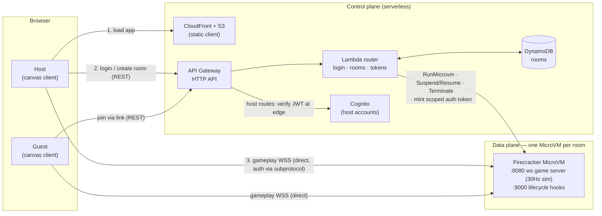

# MicroVM Asteroids

Multiplayer [Asteroids](https://en.wikipedia.org/wiki/Asteroids_(video_game)) on
**AWS Lambda MicroVMs**. One host logs in, creates a room (picking a game mode),
and shares a link; others join with no login. **Each room is a dedicated
Firecracker MicroVM** running an authoritative game server.

This is a reference sample showing how to use Lambda MicroVMs for sessionful,
real-time, WebSocket workloads — with a serverless control plane in front.

## Architecture



Two planes that never mix:

- **Control plane** (`src/control-plane`, `template.yaml`) — Lambda + API
  Gateway (HTTP API) + DynamoDB + Cognito, deployed with **AWS SAM**. Handles
  host login (Cognito), room lifecycle (`RunMicrovm` / `Suspend` / `Resume` /
  `TerminateMicrovm`), and minting short-lived MicroVM auth tokens. Also hosts
  the static web client on S3 + CloudFront.
- **Data plane** (`gameserver`) — runs *inside* each MicroVM. The
  browser connects a WebSocket **directly** to the room's MicroVM endpoint. Auth
  and target port travel as `lambda-microvms.*` WebSocket subprotocols (browsers
  can't set WS headers); the proxy strips them before they reach the server.

```
template.yaml       AWS SAM stack (DynamoDB, Cognito, HTTP API + Lambda, IAM roles,
                    S3 artifact + web buckets, CloudFront)
src/
  control-plane/    self-contained Lambda router: login, rooms, tokens (its own
                    package.json manifest; SAM esbuild-bundles it on build)
gameserver/         authoritative sim (30Hz) + ws server (:8080) + lifecycle hooks (:9000)
frontend/           vanilla TS + canvas client (input sampling, snapshot interpolation)
shared/             wire protocol, entities, mode rulesets — shared by gameserver + frontend
```

> The control-plane Lambda is deliberately **self-contained**: it does not import
> `shared`, keeping its own copy of the API contract (`src/control-plane/src/lib/contract.ts`)
> so `sam build` can bundle it from a single manifest. Its DTOs must stay in sync
> with the client's `frontend/src/net/api.ts`.

### Why MicroVMs

Each room needs a long-lived, stateful, real-time WebSocket server with strong
per-room isolation — a poor fit for short-lived request/response Lambdas, but
exactly what MicroVMs provide: one Firecracker VM per room, reachable over a
TLS-terminated WSS endpoint, suspended when idle and auto-terminated by policy.

### Game modes (host picks at room creation)

One server build supports all three; behavior is parameterized by a `Ruleset`
(`shared/src/modes.ts`) delivered to the MicroVM via the `/run` hook:

- **coop** — friendly fire off, escalating asteroid waves, survive together.
- **ffa** — friendly fire on, score = kills + rocks, respawns.
- **lastStanding** — fixed lives, no respawn, last ship alive wins.

### Server-authoritative simulation

The server runs a fixed-timestep loop at 30Hz (`sim/loop.ts`), integrating physics
(thrust, inertia, toroidal screen-wrap), resolving collisions, and applying mode
rules. Snapshots broadcast at 15Hz; clients render ~100ms in the past and
interpolate (`frontend/src/render/interp.ts`). Clients send **inputs only** — never
positions — so the server is the single source of truth.

The simulation is pure and deterministic (injected RNG + clock), which keeps it
unit-testable without any networking. See `gameserver/test`.

## Run locally (no AWS)

Each package is independent (no workspaces, no root `package.json`) — install and
build per directory, `shared` first since the others consume its compiled output.

```bash
# Install (each dir owns its node_modules), building shared first.
for d in shared gameserver frontend src/control-plane; do ( cd "$d" && npm install ); done
( cd shared && npm run build )

# Terminal 1 — game server
GAME_MODE=coop npm run dev --prefix gameserver   # ws://localhost:8080/play

# Terminal 2 — web client (local flow)
npm run dev --prefix frontend                    # then open the ?server= URL below
```

Open `http://localhost:5173/?server=ws://localhost:8080/play` in two browser
tabs, enter names, and fly. `GAME_MODE` can be `coop`, `ffa`, or `lastStanding`.

Controls: **Arrows / WASD** to move, **Space** to fire.

```bash
npm test --prefix gameserver          # unit tests for the authoritative sim
( cd shared && npm run build ) && \
  for d in gameserver frontend src/control-plane; do ( cd "$d" && npm run build ); done  # typecheck all
```

## Deploy to AWS

Deployed with **AWS SAM** for the infra and **explicit `aws lambda-microvms`
calls** for the MicroVM image. The image is a Lambda MicroVMs *service* resource,
not a CloudFormation resource — you create it directly, so those calls are laid
out here in full rather than hidden behind a script.

**Prerequisites:** an AWS account in a region where Lambda MicroVMs is available
(defaults to `us-west-2`), credentials configured, the SAM CLI installed, and
Node 20+.

### 1. Provision the infra (SAM)

Builds/deploys DynamoDB, Cognito, the HTTP API + control-plane Lambda, the
MicroVM build/exec IAM roles, the S3 buckets, and the CloudFront distribution.
`sam build` esbuild-bundles the Lambda; the first deploy may prompt via `--guided`.

```bash
export AWS_REGION=us-west-2
sam build && sam deploy          # outputs include ApiUrl and WebUrl
```

### 2. Publish the MicroVM image (direct service calls)

Bundle the game server, zip it with the `Dockerfile` **at the archive root** (the
service requires that), upload to S3, then call the service. AWS compiles the
Dockerfile server-side — no local Docker.

```bash
# --- resolve the stack outputs the image calls need ---
STACK=asteroids
ACCOUNT=$(aws sts get-caller-identity --query Account --output text)
BUCKET=$(aws cloudformation describe-stacks --stack-name $STACK \
  --query "Stacks[0].Outputs[?OutputKey=='ArtifactBucketName'].OutputValue" --output text)
BUILD_ROLE=$(aws cloudformation describe-stacks --stack-name $STACK \
  --query "Stacks[0].Outputs[?OutputKey=='BuildRoleArn'].OutputValue" --output text)
# (brace ${AWS_REGION} — a bare $AWS_REGION:aws triggers zsh's `:a` history modifier)
IMG="arn:aws:lambda:${AWS_REGION}:${ACCOUNT}:microvm-image:asteroids"
BASE="arn:aws:lambda:${AWS_REGION}:aws:microvm-image:al2023-1"

# --- bundle + zip + upload (Dockerfile at zip root) ---
npm run bundle --prefix gameserver                       # -> gameserver/dist/bundle.mjs
zip -j image.zip gameserver/Dockerfile
( cd gameserver && zip ../image.zip dist/bundle.mjs )
aws s3 cp image.zip "s3://$BUCKET/microvm-images/asteroids.zip"

# --- create the image (first time). Returns imageVersion (e.g. "1.0"). ---
#     On later publishes swap `create-microvm-image --name asteroids`
#     for `update-microvm-image --image-identifier "$IMG"` (adds a new version).
aws lambda-microvms create-microvm-image \
  --name asteroids \
  --base-image-arn "$BASE" \
  --build-role-arn "$BUILD_ROLE" \
  --code-artifact "{\"uri\":\"s3://$BUCKET/microvm-images/asteroids.zip\"}" \
  --hooks "$(cat gameserver/image-runtime.json)" \
  --environment-variables '{"GAME_PORT":"8080","HOOK_PORT":"9000","HOOKS_ENABLED":"true","NODE_ENV":"production"}'

# --- poll until the build finishes (SUCCESSFUL), then activate that version ---
VERSION=1.0
aws lambda-microvms get-microvm-image-version \
  --image-identifier "$IMG" --image-version "$VERSION" --query state --output text   # repeat until SUCCESSFUL
aws lambda-microvms update-microvm-image-version \
  --image-identifier "$IMG" --image-version "$VERSION" --status ACTIVE               # so RunMicrovm resolves it
```

### 3. Deploy the web client

Builds the client, writes `config.json` (the API URL, read at runtime), uploads to S3.

```bash
bash scripts/deploy-front.sh
```

### 4. Create a host login

Self-registration is disabled, so hosts exist only via `admin-create-user`.

```bash
POOL=$(aws cloudformation describe-stacks --stack-name asteroids \
  --query "Stacks[0].Outputs[?OutputKey=='UserPoolId'].OutputValue" --output text)
aws cognito-idp admin-create-user --user-pool-id "$POOL" --username alice \
  --message-action SUPPRESS
aws cognito-idp admin-set-user-password --user-pool-id "$POOL" --username alice \
  --password 'ChangeMe-123!' --permanent
```

Open the **WebUrl** output in a browser:

- **Host:** log in, pick a mode, **Create & play** — this runs a MicroVM, shows a
  shareable link, and drops you into a waiting room. Press **Start** when ready;
  **Pause** suspends the MicroVM (RAM+disk snapshot — game state is frozen and
  compute billing stops) and the same button resumes it; **End game** terminates
  the MicroVM. While paused, clients wait and auto-rejoin when the host resumes.
- **Guests:** open the shared `?room=<id>` link, enter a name, **Play** — no login.

> The client resolves the API at runtime from `/config.json` (written by
> `build:front` from the stack's ApiUrl output), so the same static build works
> regardless of the API URL.

**Refresh-safe:** the client persists a per-tab session (`sessionStorage`), so a
browser refresh reconnects to the same room with the same identity. The server
holds a disconnected player's ship intact for a short grace window (10s), so a
refresh resumes the **same ship at the same spot** — no death, no respawn — and
keeps score/lives. The short-lived WS token isn't stored; it's re-minted on
resume via `/tokens/{roomId}/refresh`. If the room has since closed, the client
falls back to the lobby. (Only if a player doesn't return within the window does
the disconnect count as a death / last-standing elimination.)

### Admin tasks (direct AWS CLI)

There is no bespoke admin CLI — host provisioning and image upkeep are plain AWS
calls (`POOL` and `IMG` resolved from the stack outputs / image ARN):

| Task | Command |
|---|---|
| Create a host | `aws cognito-idp admin-create-user --user-pool-id "$POOL" --username alice --message-action SUPPRESS` then `admin-set-user-password … --permanent` |
| List hosts | `aws cognito-idp list-users --user-pool-id "$POOL"` |
| Delete a host | `aws cognito-idp admin-delete-user --user-pool-id "$POOL" --username alice` |
| Publish / update image | the `aws lambda-microvms create/update-microvm-image` sequence in [Deploy step 2](#2-publish-the-microvm-image-direct-service-calls) |
| Prune old image versions | `aws lambda-microvms list-microvm-image-versions --image-identifier "$IMG"` then `delete-microvm-image-version` on inactive ones |

## Cost & teardown

Rooms auto-suspend after 15 min idle and auto-terminate 30 min later; the hard
cap is 8 hours. The host's **End game** button terminates immediately. DynamoDB
rows expire via TTL. To remove everything:

```bash
# delete inactive image versions (storage cost), then tear down all SAM infra
IMG="arn:aws:lambda:$AWS_REGION:$(aws sts get-caller-identity --query Account --output text):microvm-image:asteroids"
aws lambda-microvms list-microvm-image-versions --image-identifier "$IMG"  # find inactive versions
# aws lambda-microvms delete-microvm-image-version --image-identifier "$IMG" --image-version <v>
sam delete --stack-name asteroids                    # tear down all SAM infra
```

> MicroVM image versions incur storage cost even when no VM is running — prune
> them when you're done.

## Security notes

- **Host accounts live in Amazon Cognito** with self-registration **disabled** —
  accounts exist only via `admin-create-user` (AdminCreateUser). Login uses
  the admin auth flow and returns a Cognito ID token; **host routes are protected
  by an API Gateway Cognito JWT authorizer**, so the token is verified at the edge
  and never reaches application code unverified. No hand-rolled auth.
- **Guests are anonymous and ephemeral** — never Cognito users. On join they get
  a random **opaque session token**; the control plane stores the
  `{token → room, guest}` binding in DynamoDB. It needs no signing secret, is
  **revocable** (delete the row), and auto-expires via the table's TTL.
- MicroVM auth tokens are scoped to a single VM and the gameplay port only, and
  expire within 60 min (the client refreshes proactively). A guest of one room
  cannot mint a token for another.
- Host-only powers (start the round) are gated by a per-room secret delivered only
  to the room creator — not by a client-claimed identity.
- IAM roles are least-privilege with an `aws:SourceAccount` confused-deputy
  condition; the in-VM execution role has logs-only access.

### Why Cognito for hosts (and not guests)

Hosts are credentialed users, so they get a managed identity provider: Cognito
handles password storage, lockout, and token signing/rotation; disabling
self-sign-up enforces "CLI-provisioned only"; and an API Gateway JWT authorizer
verifies host tokens at the edge so we never hand-roll auth.

Guests are deliberately *not* in the pool — they're anonymous, throwaway
identities tied to one room. Rather than mint a signed JWT for them (which means
managing a signing secret), we issue an **opaque token backed by a DynamoDB
session row**: no secret to store or leak, revocable, and TTL-reaped. This is the
textbook server-side-session pattern, and it scales cleanly — the per-request
lookup happens only on the handful of guest control-plane calls (join, refresh,
status poll), never during gameplay (which goes straight to the MicroVM).

## License

[MIT-0](./LICENSE).
